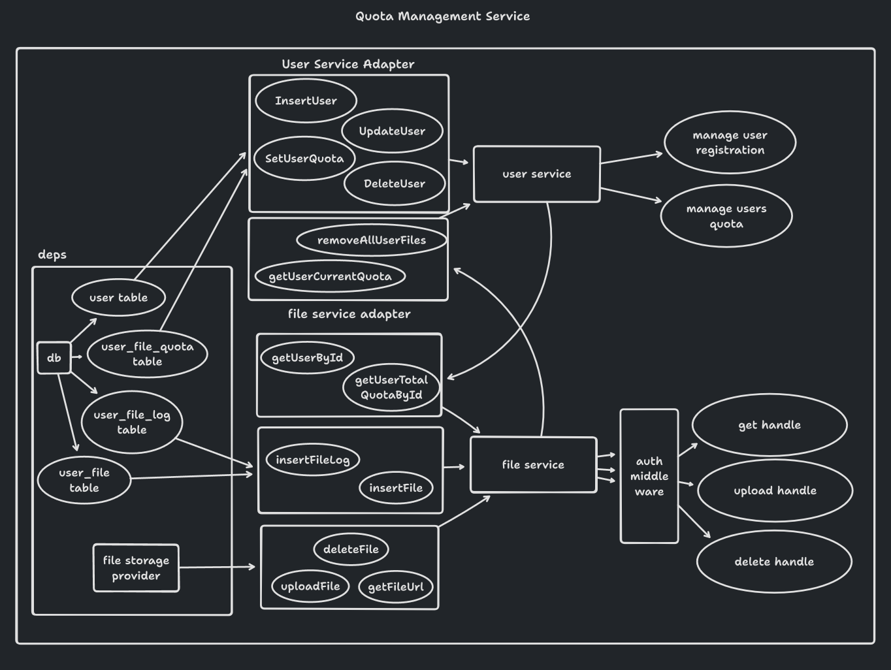
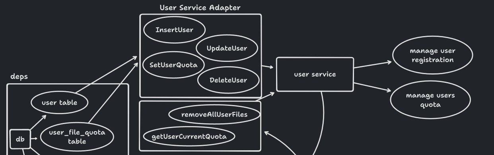
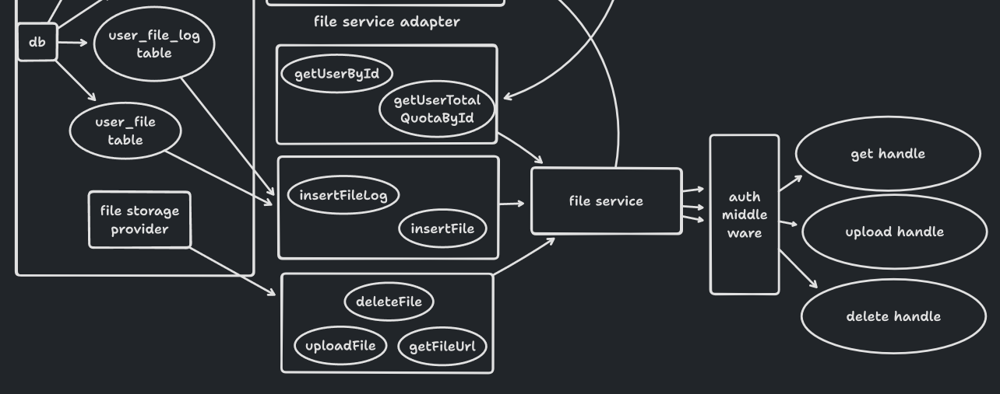

# Quota Management Service

### How to run
> The project is not finished yet due to time constraint!
#### Install all dependencies
```bash
yarn install
```

## Overview

#### Why the the code architecture is like this?
Short answer: separation of concern, scalability, and maintainability

Long answer:
We all had it, the experience of building a backend where we only think about the features that should be provided, but along the way, feature additions makes our code fall apart, we put business logic everywhere, and thus, we forcing to do a unit test, but because we don't think about separation of concern at start, our unit test is not "unit" anymore, unit testing evolves into integration testing where we use staging database, and requesting external dependencies directly for each test because "mocking it is too hard"

That's why we build this backend with separation of concern at start, some call this architecture "Clean Architecture" some call it "Hexagon Architecture" but in essense, the goal is to isolate business process to it's dependencies, so if the user service is placed at other server or changed to Elixir for some reason, the file service should not (or just a bit) changed to adjust to the new service, thus make a business logic easier to maintain, and scalable if we want to split this into multiple microservices


## Services
#### User Services
This service is solely intended to provide services related to the user, it mainly used by the administrator to set each user infromation and quotas

But as you can see, we have an `Adapter` called `removeAllUserFiles` and `getUserCurrentQuota`, those are user service dependencies that should be provided in order to user service to work normaly, the reasons are:
- an administrator is able to remove a user, so if there's a file that the user is till having, we should remove it
- while getting a list of users, administrator might want to have the usage of users quotas
- we also don't want the administrator to reduce quota if the current usage of the quota is above the new limit

------
#### File Service
This service is intended to manage file uploads

In here, we have an `Adapter` called `geyUserById` and `getUserTotalQuotaById`, those are needed in order to file service to work normally too, the reasons are:
- we don't want our user to upload files above their quota right?
- we should know from each request, is the user is authorized to upload a file
---

## Databases
It is a good practice to just use an open source database at first, either MySql, Postgres or MongoDB, but in here I choose to use Postgres because it has plethora of plugins, it saves us time if we want to extend the product later on, for example, PostGIS for handling geographical data, just in case if we want to extend this app to record user location, or PgBouncer if we have a limitation on our database pooling strategies

## Limitations
Even though, this backend app is really cool, there are noticable limitation that you should know
### File Search
At first, searching from the database is enough for this feature, but don't have time for it yet
### Big file uploads
Due to webserver limitation (well, we can override the limit but we should beware for DoS attacks)
### Resuming uploads and upload progress
Upload with resume & progress feature requires connection from a websocket, though it's not hard to implement at the backend but it requires some agreement with other parties about the contract
### Foldering
We can just use the file path for example `/folderA/fileA.jpg`, but what happen if the user only wants to create a folder with no content? That's for another story
### Multiple folder ownership
We could by modifying the user service, but only develop when there's a need right? Hehehe
### Thumbnail
In order to do this, we should modify the file service to compress the file for each upload to smaller size for thumbnail, doable